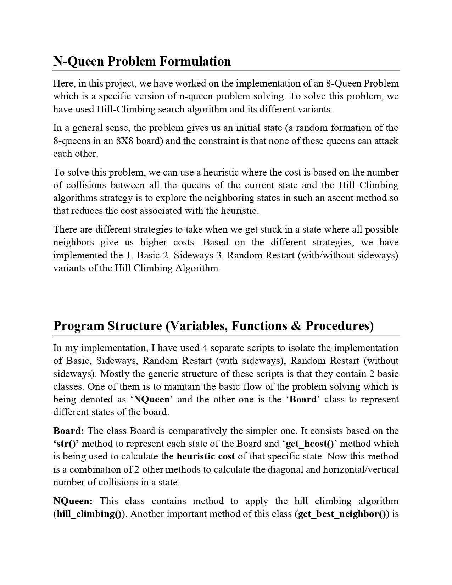
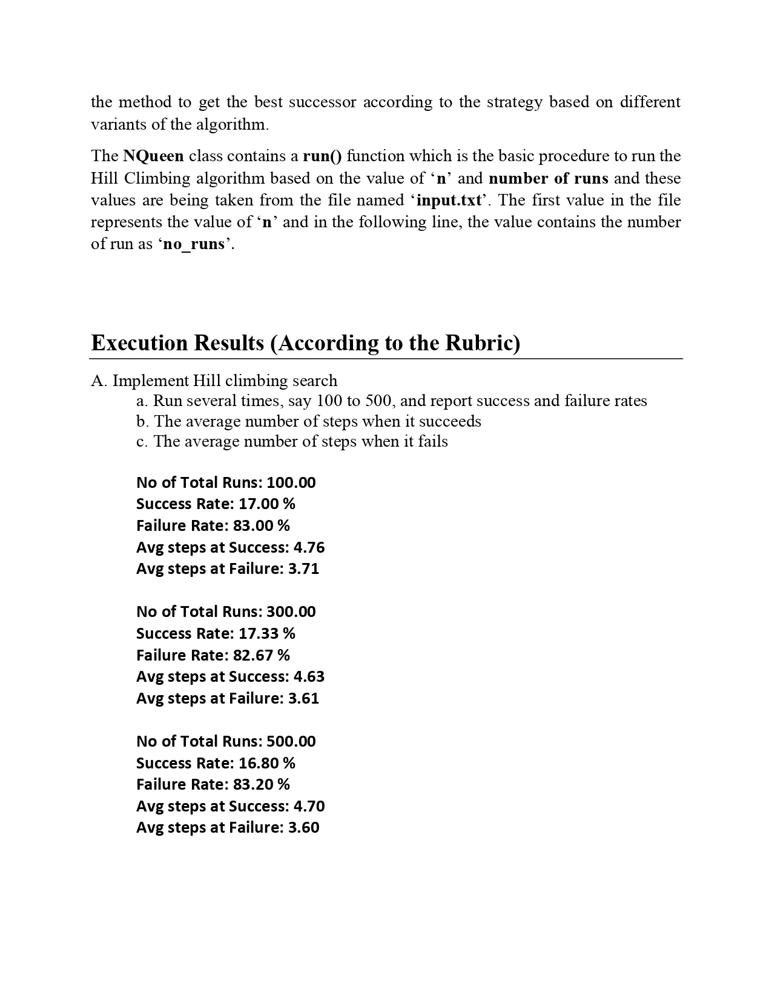
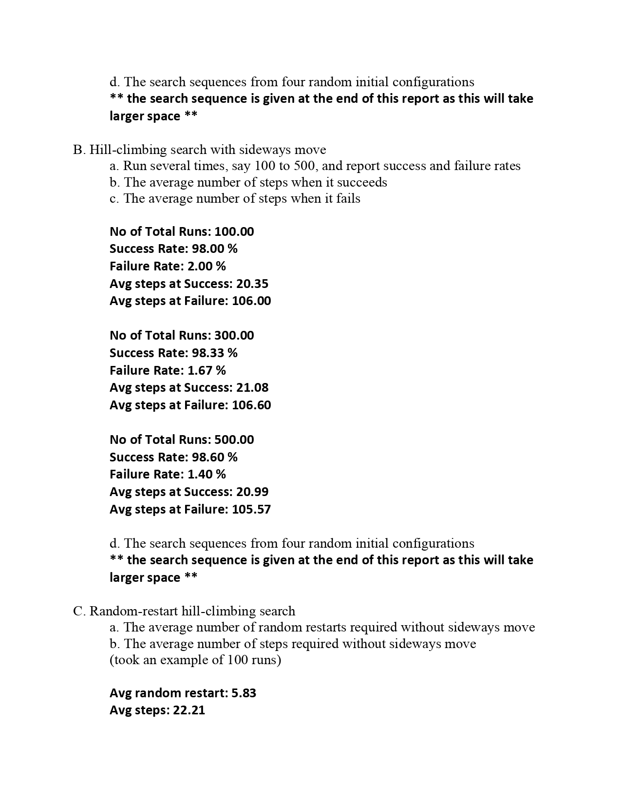
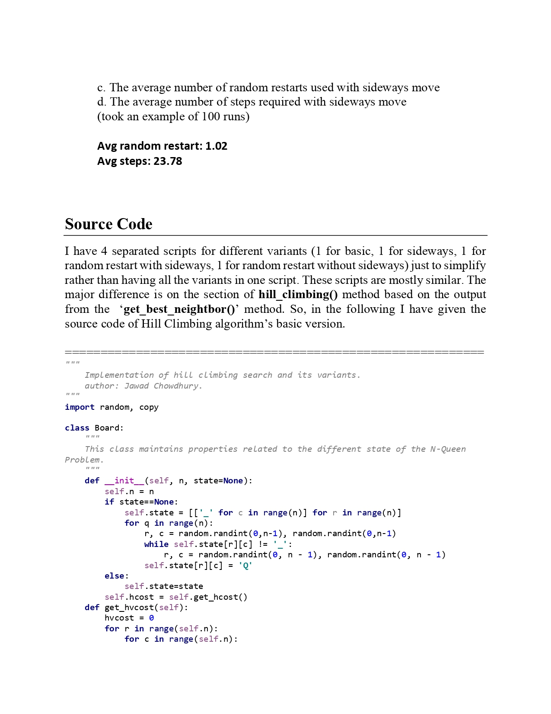
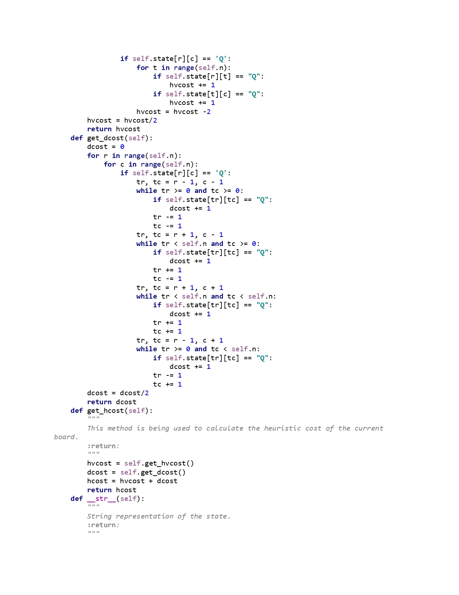
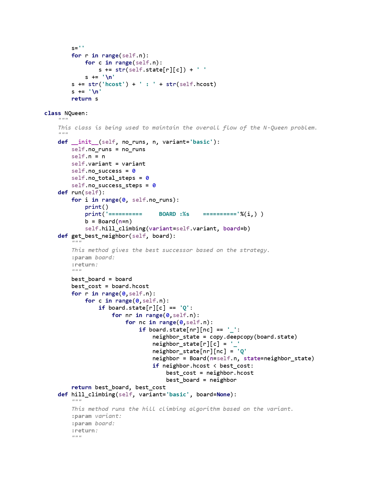
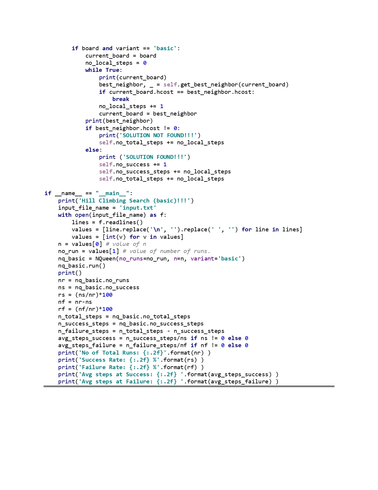

# Project Report - Hill Climbing Algorithm and It's Variants (N-queens Problem)

### Submitted By:
**Jawad Chowdhury**

---

## Report Pages

### Page 1&2

### Page 3

### Page 4

### Page 5

### Page 6

### Page 7

### Page 8

